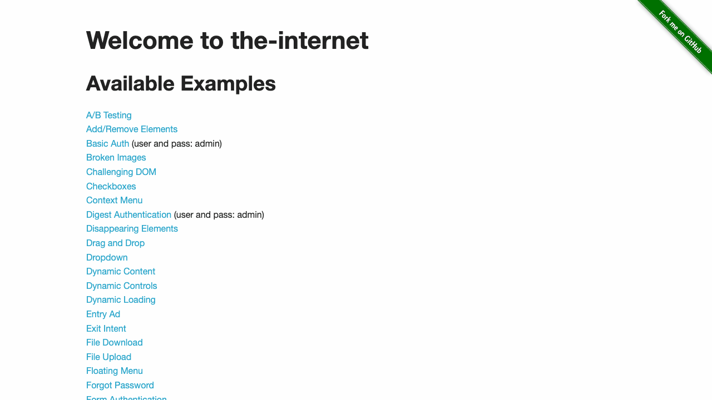
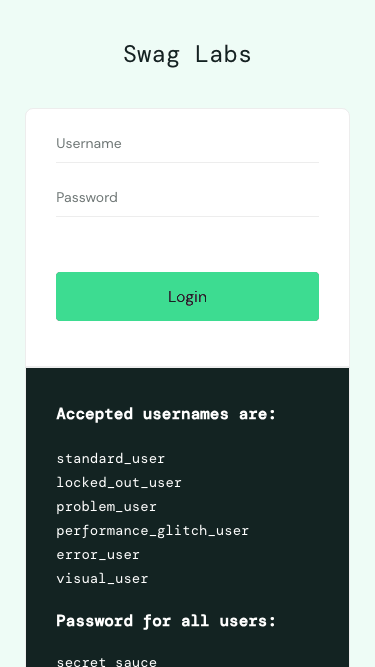
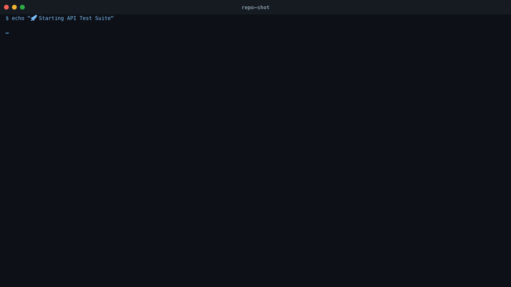
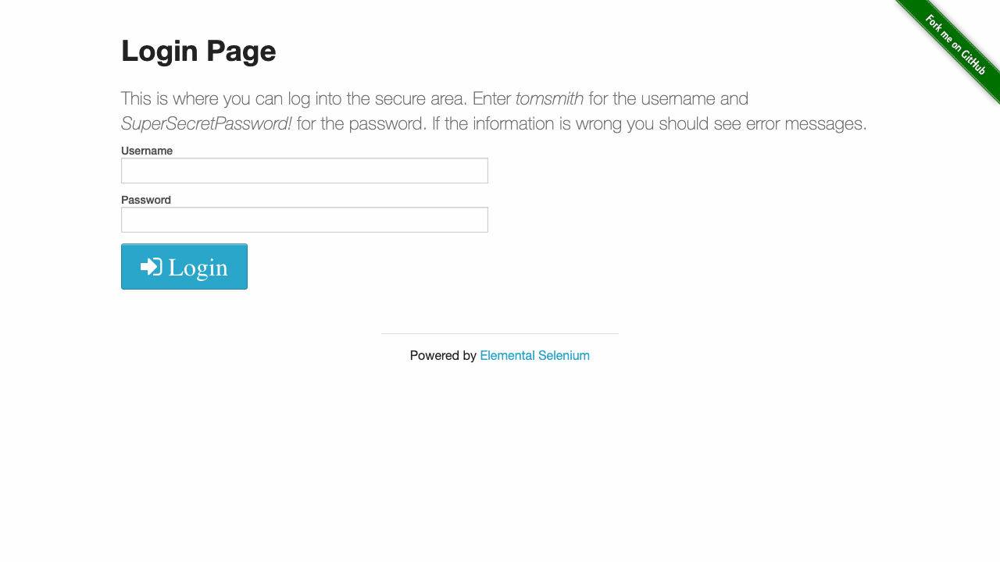
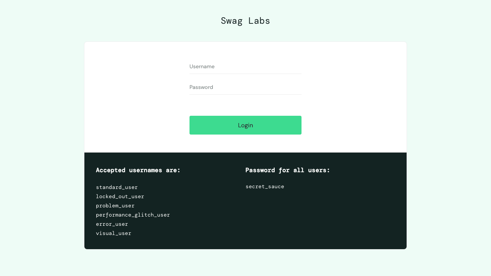

# repo-shot

<div align="center">


**Stop recording demos by hand. Write YAML once, GIF forever.**

**Turn any CLI workflow or browser session into a polished GIF — automatically.**


[](https://www.npmjs.com/package/repo-shot)
[](./LICENSE)
[](https://nodejs.org/)
[](https://playwright.dev/)


> Write a YAML file. Run one command. Ship a perfect GIF to your README, PR, or docs — forever.

[**Quickstart**](#quickstart) · [**Templates**](#template-library) · [**Examples**](#examples) · [**CLI Reference**](#cli-reference)

</div>

---

## The Problem

Your README screenshots are **stale**. Your demo GIFs are **outdated**. Your docs team is
running OBS and Gifski manually every sprint. You paste in a screenshot that was taken 3
months ago and still shows the old logo.

**repo-shot fixes that.**

Define your demo in YAML once. Every time you push, it re-records and regenerates — real
commands, real browser, real output. No lies, no stale screenshots, no busywork.

---

## What It Looks Like

### Terminal Demos


> Record real shell commands — `npm install`, API calls, file operations, piped output.

### Browser Demos



> Automate any web UI — login flows, dropdowns, form submission, checkout journeys.

### Mobile Viewport



> Record at 375×667 or any resolution. Desktop, tablet, mobile — all covered.

---

## Quickstart

**Prerequisites:** Node.js 18+

```bash
npm install -g repo-shot
```

Create `scenario.yml`:

```yaml
scenario:
  name: My First Demo
  steps:
    - type: shell
      command: echo "Hello, repo-shot!"
      caption: "Running my first command"
    - type: shell
      command: ls -la
      caption: "Listing files"
```

Run it:

```bash
repo-shot run scenario.yml
# ✓ Demo generated successfully
# Artifacts:
#   • ./artifacts/demo.gif
```

That's it. Open `./artifacts/demo.gif` and drop it in your README.

---

## Features

<table>
<tr>
<td width="50%">

### 🖥️ Terminal Recording
Record actual shell commands with authentic output — not fake typed animations.
Supports pipes, multi-step sequences, and complex commands like `curl | jq`.

</td>
<td width="50%">

### 🌐 Browser Automation
Playwright-powered browser recording. Navigate, click, fill forms, take screenshots.
Works with any site — no special setup needed.

</td>
</tr>
<tr>
<td width="50%">

### 🎬 Pure JS GIFs
No ffmpeg. No external dependencies. Canvas-based rendering with macOS-style terminal
UI. Generate GIFs at any resolution.

</td>
<td width="50%">

### 🤖 GitHub Actions
Auto-post generated GIFs as PR comments. Every pull request gets a live demo
attached — zero manual work.

</td>
</tr>
<tr>
<td width="50%">

### 📐 Any Resolution
Pass `--width` and `--height` flags, or set viewport in YAML. 1280×720, 375×667
mobile, 1920×1080 full-HD — your call.

</td>
<td width="50%">

### 📦 8 Ready Templates
Terminal, browser, mobile, e-commerce, API testing — copy one and customize. All
tested against real public demo sites.

</td>
</tr>
</table>

---

## Examples

### Example 1 — CLI Demo


```bash
repo-shot run templates/cli-demo.yml
```

```yaml
scenario:
  name: CLI Demo
  steps:
    - type: shell
      command: echo "Hello from repo-shot"
      caption: "Say hello"
    - type: shell
      command: ls -la
      caption: "List project files"
```

---

### Example 2 — API Testing with `curl | jq`



```bash
repo-shot run templates/api-testing.yml
```

```yaml
scenario:
  name: API Testing
  steps:
    - type: shell
      command: curl -s https://jsonplaceholder.typicode.com/posts/1 | jq '.title'
      caption: "Fetch a post title"
```

---

### Example 3 — Browser Login Flow



```bash
repo-shot run templates/form-submission.yml
```

```yaml
scenario:
  name: Login Flow
  steps:
    - type: navigate
      url: https://the-internet.herokuapp.com/login
      caption: "Open login page"
    - type: fill
      selector: "#username"
      text: "tomsmith"
      caption: "Enter username"
    - type: fill
      selector: "#password"
      text: "SuperSecretPassword!"
      caption: "Enter password"
    - type: click
      selector: "button.radius"
      caption: "Submit"
    - type: screenshot
      caption: "Logged in!"
```

---

### Example 4 — E-Commerce Checkout



```bash
repo-shot run templates/ecommerce-checkout.yml
```

Full flow: login → add to cart → proceed to checkout → fill shipping → confirm.

---

### Example 5 — Mobile Responsive at 375×667


```bash
repo-shot run templates/mobile-responsive.yml
```

Records at iPhone SE dimensions. Shows exactly what mobile users see.

---

### Example 6 — Mixed Terminal + Browser

```yaml
scenario:
  name: Full Deploy Workflow
  steps:
    # Terminal: build the project
    - type: shell
      command: npm run build
      caption: "Build project"

    # Browser: verify in the UI
    - type: navigate
      url: http://localhost:3000
      caption: "Open in browser"
    - type: screenshot
      caption: "Build deployed!"
```

Generates two GIFs: `demo.gif` (terminal) and `browser-demo.gif` (browser).

---

### Example 7 — GitHub Actions

A ready-made workflow is already included at [`.github/workflows/repo-shot.yml`](.github/workflows/repo-shot.yml). It runs on every PR open/sync and on releases.

```yaml
# .github/workflows/repo-shot.yml
name: repo-shot Demonstration

on:
  push:
    types: [released]
  pull_request:
    types: [opened, synchronize, reopened]

jobs:
  repo-shot-demo:
    runs-on: ubuntu-latest
    permissions:
      pull-requests: write
      contents: read

    steps:
      - uses: actions/checkout@v4

      - uses: actions/setup-node@v4
        with:
          node-version: '18'
          cache: npm

      - run: npm ci
      - run: npm install --save-dev chalk playwright

      # Record terminal demo
      - run: npx repo-shot action --template templates/cli-demo.yml --output artifacts/cli-demo
        continue-on-error: true

      # Record browser demo
      - run: npx repo-shot action --template templates/web-ui-flow.yml --output artifacts/web-ui-flow --headless
        continue-on-error: true

      # Upload GIFs as workflow artifacts
      - uses: actions/upload-artifact@v3
        if: always()
        with:
          name: repo-shot-artifacts
          path: artifacts/
          retention-days: 30

      # Post GIF links as a PR comment
      - uses: actions/github-script@v7
        if: github.event_name == 'pull_request'
        with:
          script: |
            github.rest.issues.createComment({
              issue_number: context.issue.number,
              owner: context.repo.owner,
              repo: context.repo.repo,
              body: '## 📸 repo-shot Demo\nGIFs uploaded — see **Artifacts** tab above.'
            });
        continue-on-error: true
```

**Key points:**
- `--template` path is relative to the repo root
- `--headless` is required for browser steps in CI (no display server)
- `permissions: pull-requests: write` is needed for the PR comment step
- `continue-on-error: true` on each step so a failing demo doesn't block the PR
- GIFs are available under the **Artifacts** tab of the Actions run for 30 days

To use this in your own repo, copy `.github/workflows/repo-shot.yml` and adjust the `--template` paths to point at your own scenario files.

---

## Template Library

8 production-ready templates, all tested against real public sites.

### Terminal Templates

| Template | What It Does | Command |
|---|---|---|
| `cli-demo.yml` | Echo, ls, file ops | `repo-shot run templates/cli-demo.yml` |
| `install-hello.yml` | npm install + verification | `repo-shot run templates/install-hello.yml` |
| `api-testing.yml` | REST API calls with `curl \| jq` | `repo-shot run templates/api-testing.yml` |

### Browser Templates

| Template | What It Does | Site |
|---|---|---|
| `web-ui-flow.yml` | Dropdown interaction | the-internet.herokuapp.com |
| `form-submission.yml` | Login form with validation | the-internet.herokuapp.com |
| `dashboard-analytics.yml` | Add/remove elements | the-internet.herokuapp.com |
| `ecommerce-checkout.yml` | Login → cart → checkout | saucedemo.com |
| `mobile-responsive.yml` | Mobile 375×667 shopping flow | saucedemo.com |

Use any template as-is or as a starting point:

```bash
cp templates/ecommerce-checkout.yml my-shop-demo.yml
# Edit selectors for your own site
repo-shot run my-shop-demo.yml
```

---

## CLI Reference

```
repo-shot run <scenario>        Record and generate GIF/MP4/WebM
  --output <dir>                Output directory       (default: ./artifacts)
  --format <fmt>                Output format: gif, mp4, webm (default: gif)
  --theme  <name>               Terminal theme: dark, light, dracula, nord (default: dark)
  --width  <px>                 Width in pixels        (default: 1280)
  --height <px>                 Height in pixels       (default: 720)
  --timeout <ms>                Step timeout           (default: 60000)

repo-shot preview <scenario>    Quick preview, no optimization
  --format <fmt>                Output format: gif, mp4, webm (default: gif)
  --theme  <name>               Terminal theme: dark, light, dracula, nord (default: dark)

repo-shot template list         List built-in templates
repo-shot template init <name>  Scaffold a new scenario file
```

**Resolution priority** (highest wins):
1. `--width` / `--height` CLI flags
2. `metadata.browser_config.viewport` in YAML
3. Default: `1280 × 720`

---

## Step Reference

### Terminal Steps

```yaml
- type: shell         # Run a single command
  command: npm test
  caption: "Running tests"
  delay: 500

- type: sequence      # Run multiple commands in order
  commands:
    - npm install
    - npm run build
    - npm test
  caption: "Full build pipeline"
```

### Browser Steps

```yaml
- type: navigate      # Go to a URL
  url: https://example.com
  timeout: 30000

- type: click         # Click an element
  selector: "button.primary"

- type: fill          # Fill a form field
  selector: "#email"
  text: "user@example.com"

- type: wait          # Pause
  delay: 1500

- type: screenshot    # Capture the current state
  caption: "Result"
```

---

## Installation Notes

**macOS:**
```bash
xcode-select --install   # Build tools for native modules
npm install -g repo-shot
npx playwright install chromium
```

**Ubuntu/Debian:**
```bash
apt-get install -y python3 build-essential
npm install -g repo-shot
npx playwright install chromium --with-deps
```

**Windows:** Requires Visual Studio Build Tools and Python 3. See [node-gyp docs](https://github.com/nodejs/node-gyp#on-windows).

---

## Roadmap

- [x] Terminal recording
- [x] Browser recording (Playwright)
- [x] Pure JS GIF generation (no ffmpeg)
- [x] Configurable resolution
- [x] GitHub Actions integration
- [x] 8 production templates
- [x] MP4 / WebM export
- [x] Custom terminal themes (dark, light, Dracula, Nord)
- [ ] Cloud upload (S3, Cloudinary, Vercel Blob)
- [ ] VS Code extension
- [ ] Batch scenario runner
- [ ] Interactive scenario builder UI

---

## Contributing

```bash
git clone https://github.com/your-org/repo-shot
cd repo-shot
npm install
npm test
```

1. Fork → branch → commit → PR.
2. Run `npm test` before submitting.
3. Add a template in `templates/` if your PR adds a new use case.

---

## License

MIT — see [LICENSE](./LICENSE).

---

<div align="center">

**Built for developers who ship.**

*Stop recording demos by hand. Write YAML once, GIF forever.*

</div>